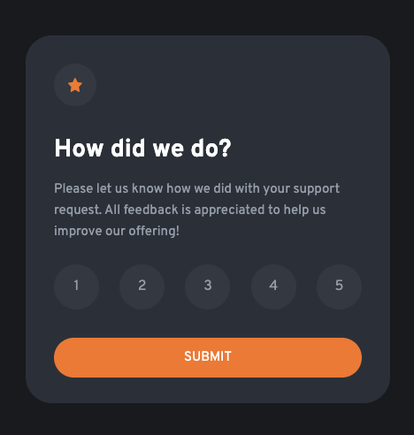
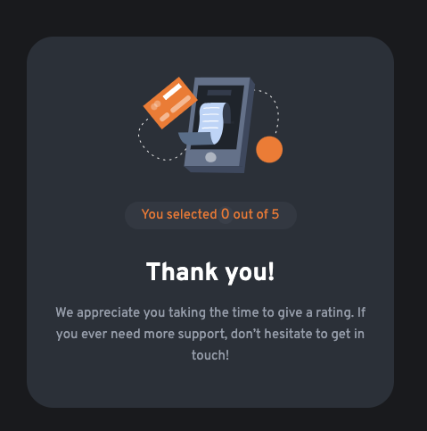
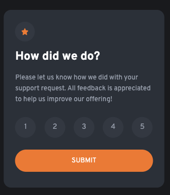
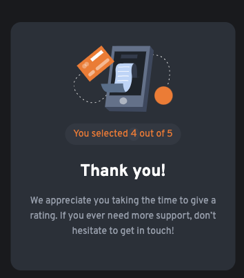
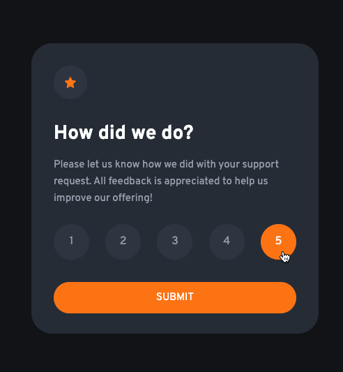

# Frontend Mentor - Interactive rating component solution

This is a solution to the [Interactive rating component challenge on Frontend Mentor](https://www.frontendmentor.io/challenges/interactive-rating-component-koxpeBUmI). Frontend Mentor challenges help you improve your coding skills by building realistic projects. 

## Table of contents

- [Overview](#overview)
  - [The challenge](#the-challenge)
  - [Screenshots](#screenshot)
  - [Built with](#built-with)

## Overview

The project is to build out this landing page and get it looking as close to the design as possible.

All the required assets for this project are in the `/assets` folder. The images are already exported for the correct screen size and optimized. The starter code also include font files for the required fonts for this project.

### The challenge

Users should be able to:

- View the optimal layout for the interface depending on their device's screen size
- See hover and focus states for all interactive elements on the page

### Screenshots

#### Desktop:

  

 

  

#### Mobile:

  

 

  

#### Active states:

  

 

  

 

### Built with

- Semantic HTML5 markup
- CSS custom properties
- Flex
- Media queries
- JavaScript DOM-manipulations
- Visual Studio Code